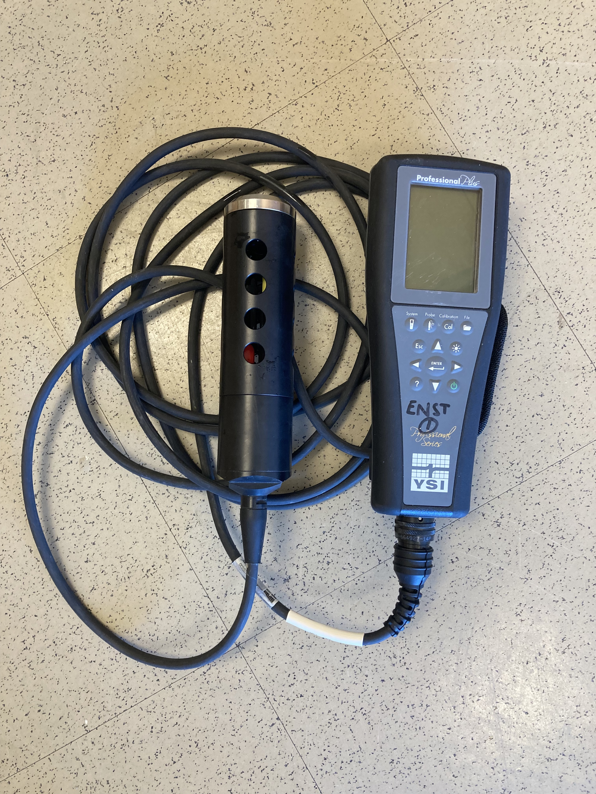
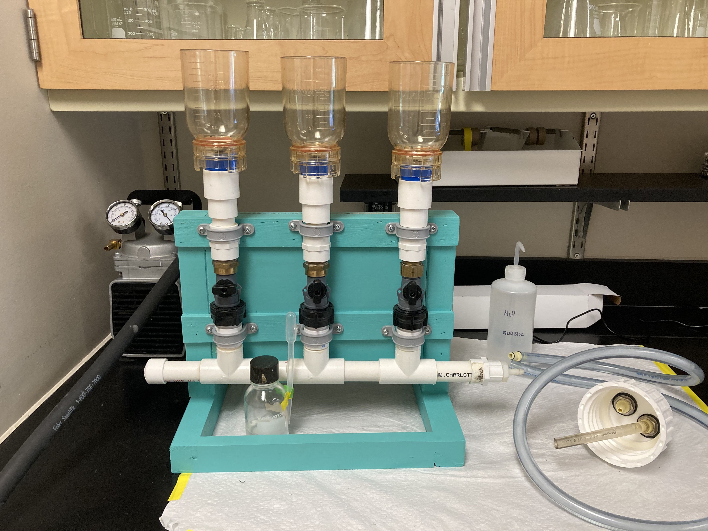
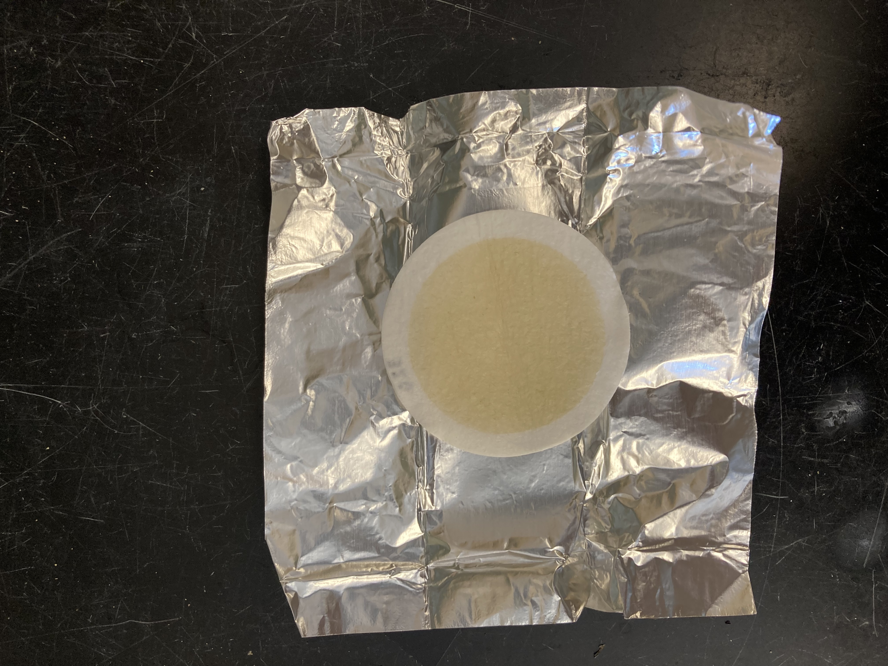

```{r setup, include=FALSE}
library(flexdashboard)
library(shiny)
library(shinydashboard)
library(tidyverse)
library(viridis)
library(lubridate)
library(httr)
library(rsconnect)
```

```{r, include = FALSE}
#read in data and weather script
source("scripts/weather.R")

ysi <- read_csv("https://raw.githubusercontent.com/smr-monitoring/data-processing/main/data_processed/ysi.csv")
tss <- read_csv("https://raw.githubusercontent.com/smr-monitoring/data-processing/main/data_processed/tss.csv")
kd <- read_csv("https://raw.githubusercontent.com/smr-monitoring/data-processing/main/data_processed/kd.csv") 
npp <- read_csv("https://raw.githubusercontent.com/smr-monitoring/data-processing/main/data_processed/npp_avg.csv")
#weather_data <- read_rds("weather-smcmdock.rds") %>%
#  tidyr::separate(., datetime, c("date", "time"), sep = " ") %>%
#  mutate(day = as.Date(date)) %>%
#  group_by(day) %>% 
#  summarise(across(c(wind_avg, pressure, airtemp, rel_hum, uv_index, rain_accum, strike_ct), mean))
```


# OVERVIEW 

#### Welcome to the St. Mary's River monitoring dashboard.

```{r, echo = F, out.width = '100%', fig.align = 'center'}
knitr::include_graphics('www/waterfront.jpg')
```


# YSI SAMPLING {data-navmenu="METHODS"}

**YSI procedures to measure:** <br>
- *Dissolved oxygen* <br>
- *Temperature* <br>
- *Salinity* <br>
- *pH*

Some of the water quality measurements are taken using a YSI sonde. A sonde is commonly defined as a group of sensors configured together, which typically have a single recording unit or electronic data logger to record the output from the multiple sensors. Sensors/probes are available for measurement of many physical properties and chemical constituents such as temperature, specific conductance, DO, pH, etc. Each sonde has a probe guard, which protects the sensors during field use.

We take measurements from the surface of the water and from the bottom. Surface readings are taken by lowering the unit into the water just below the surface and held there until the readings stabilize. To take the bottom readings, lower to the bottom and the lift so the sensor is not touching the bottom.

Row {data-width=1000}
----------------------

```{r, echo = F, out.width = '30%', fig.align = 'center'}

```


# TSS FILTERING {data-navmenu="METHODS"}

## Column {.sidebar}

**TSS Filtering**

To filter for TSS, we use a GAST vacuum pump & water rig and 47mm Whatman GF/F circle filter pads.

```{r, echo = F, out.width = '100%', fig.align = 'center'}

```
<br>
```{r, echo=F, out.width='100%', fig.align='center'}

```


## Column {data-width='1000'}

**Procedures**

1. To collect a sample, rinse a 1-l nalgene container three times with sample water, then fill with sample water.
2. Label a foil packet using a sharpie with the location, date and time, filter number, and volume filtered. 
3. Center a prenumbered, combusted, weighed 47mm GFF Filter Pad on the filter holder (frit) number side down if number is visible. Secure the filtration funnel to the frit.
4. Rinse a graduated cylinder three times with sample water.
5. Measuring with a graduated cylinder and a funnel, pour 200 mL of sample water into the filter holder. Ensure it is tight before pouring to avoid spills. Clogging the filter pad is not recommended or necessary. 
6. Check that the two hoses–from the vacuum pump and from the filtration rig– are securely clipped into the Nalgene 20 liter jug. Check the origin of each hose, and DO NOT plug the vacuum hose into the entrance labeled for water. 
7. Turn on the pump using the labeled switch on the right-hand side of the machine. 
8. Rinse the filter funnel unit twice with deionized (DI) water after the initial volume has filtered through the pad. This step is VERY IMPORTANT because it rinses out the salt. 
9. Turn off the pump before unscrewing the filtration tunnel and removing the filter pad. Using 2 forceps and without touching the material on the filter, fold the filter in half with the filtered material on the inside of the fold. Remove the folded pad from the filtration unit with forceps and place inside your prelabeled aluminum foil packet (see example to the right). Do not touch the filter pad or the inside of the foil pouch with your fingers.  Sometimes the folded filter pad will pop open as you are attempting to place it in the foil packet.  If this occurs, use forceps to hold the folded filter pad in half and then fold the aluminum packet closed.  Make sure that only the outside of the folded pad (area without filtered material directly on it or visible) is touching the foil. If you have not already done so, fold all sides of the aluminum packet closed. 
10. Record the date, time, location, filter number, and total volume filtered on each foil packet and on the data sheet.
11. Label a zip lock freezer bag using a black sharpie marker with the date and “SMCM docks”, place the packet into the freezer bag, and store on ice until freezing.
12. Unclip the water and vacuum hoses from the jug. Some water may come out of the water hose. Place the tip of the hose in a small container to avoid spills.
13. Unscrew the top from the jug. Both ports will be visible on the underside, one with a short length of tubing. Use a soft sponge and deionized water to clean the outside of the tube, but do not allow water to drip on the vacuum port.
14. Dispose of the processed sample water, and rinse the inside of the 20 liter jug with deionized water. This cleaning is only necessary after all of a day’s samples have been processed, and does not need to be done between sites. Allow all parts of the system to dry overnight before use the next day. 

# Kd {data-navmenu="METHODS"}

Licor is used to take a light profile of the water column. 

# ECOSYSTEM PRODUCTION {data-navmenu="METHODS"}

## Column {.sidebar data-width=325}

**Ecosystem Production**

One technique used to measure ecosystem production is the light/dark bottle method. In clear-glass "light" bottles, we can incubate water from the estuary over a period of time to indirectly measure photosynthesis, or gross primary productivity. If photosynthesis is greater than respiration in the light bottle, then O2 will increase over time. However, whole-community respiration (R) is still occurring in the light bottles, because all organisms living in the water are respiring. This means that a light bottle gives you an estimate of net ecosystem productivity (NEP).

Using another set of "dark" bottles (painted to prevent light from entering), we can fill them with river water and let them incubate over time. Since photosynthesis is blocked in these bottles, O2 declines through time solely as a result of decomposition and respiration of carbon compounds floating in the water (by bacteria, plankton, macroinvertebrates). Thus, the dark bottles give us a rate of total ecosystem respiration through time (R).

The difference between the final oxygen concentrations between the light and dark bottles is thus a measure of total photosynthesis, or gross primary production (GPP). Therefore, with some relatively simple measurements of O2, we are capable of teasing apart the individual components of estuary metabolism.

## Column {data-width=1000}

**Procedure**

1. Take YSI readings at both the surface and bottom. Be sure to measure the depth of the water column. Record these observations on your datasheet.
2. Secure a standard garden hose to the provided attachment of the portable utility pump. Using a line marked with depth, lower the pump beneath the surface, and turn on using the button beneath the handle. DO NOT DRY RUN THE PUMP.  
3. Lower the pump carefully until it just barely touches the bottom, then lift it up so that it is not touching the bottom. Allow the water to run for a few seconds to flush any sediment out of the pump.
4. Fill one light and one dark BOD bottle with bottom sample water by inserting the tip of the hose into the bottom. Let the water overflow for several minutes to rinse the bottle and force out any air bubbles. Keep filling the bottle as you withdraw the tube so that the bottle is completely filled. Place the stopper on the bottle.
5. Repeat for your light bottle. 
6. Take both bottles to the BOD probe station. Insert the BOD probe into the top of the bottle, turn the stirrer on with the red switch, and take an initial DO measurement. Turn the switch back off before removing the probe. Repeat for your other bottle.
7. Using the carabiner clips, attach the bottom light and dark bottles to the lowest loop of the pre-prepared line, closer to the anchor than the buoy. This line will allow the bottles to sit at their initial depth, and temperature fluctuations inside the bottles will match their natural environment.
8. Collect water from the middle of the water column (calculated from actual depth recorded during YSI stage) and repeat the steps above. Carefully lift the line out of the water, secure both bottles to the mid-line loop using carabiners, AND attach the wave gauge between the bottles using a carabiner. This will measure the change in bottle depth during the tidal cycle. 
9. Collect water from just below the surface of the water column and repeat the steps above. Carefully lift the line out of the water, secure both bottles to the surface loop using carabiners, and lower back into the water.
10. Using a boat hook, lift the entire line (from just below the buoy) and move it approximately five feet from the dock. This is to ensure the bottles will not fall under the dock’s shadow, altering photosynthesis and production measurements. 
11. Allow the bottles to incubate for 4 hours.
12. Return after the determined time period, and use the boat hook to pull the entire line back within arm’s length of the dock. 
13. Lift the buoy and top third of the line onto the dock, and unclip the surface light and dark bottles. Lower the line back into the water to keep the middle and bottom bottles to keep them at their environmental temperature, which prevents last-minute P and R changes. 
14. Take both bottles to the BOD probe station, and repeat the instructions in step 6 to find the final DO measurement.
15. Repeat steps 13 and 14 with the middle and bottom water bottles, lifting the full anchor and line onto the dock once the bottom bottles have been removed.


# YSI {data-navmenu="VISUALIZATIONS"}

## Column {.sidebar}

**YSI**

```{r}
select_values <- c(
         `Temperature (C)` = "temp_c",
         `DO (%)` = "do_percent",
         `DO (mg/l)` = "do_mg_l",
         `Conductivity (uS/cm)` = "conductivity_us_cm",
         `Salinity (PSU)` = "salinity",
         "pH" = "pH")

selectInput(
    "y_var",
    label = "Parameter",
    choices = select_values,
    selected = 'sample_date')

dateRangeInput("sample_date",
               "Select a date range",
               start = "2022-05-25")
```

## Column {data-width="1000"}

```{r}
renderPlot({
  ysi %>%
    filter(sample_date >= as.Date(input$sample_date[1]),
           sample_date <= as.Date(input$sample_date[2])) %>%
    ggplot(., aes_string(x = "sample_date", y = input$y_var, color = "depth_m")) +
    geom_point(size = 2.5) +
    geom_line() +
    labs(x = "", y = names(select_values[which(select_values == input$y_var)]), color = "Depth") +
    theme_linedraw() +
    scale_color_viridis_d(begin = 0.2, end = 0.8)
})

DT::renderDataTable({
    
    ysi_table <- ysi
    
    DT::datatable(ysi_table,
                  extensions = "Scroller",
                  filter = "top", 
                  options = list(
                    deferRender = TRUE,
                    scrollY = 300,
                    scroller = TRUE),
                  rownames = FALSE)
  }) 
```

# TSS {data-navmenu="VISUALIZATIONS"}

## Column {.sidebar}

**Total Suspended Solids**

```{r}
dateRangeInput("date",
                "Select a date range",
                 start = "2022-05-25")
```

TSS is the amount of total suspended solids in the water, measured in mg/l. TSS includes any particles that are large enough to be retained on a 0.7 um filter. 

## Column {data-width="1000"}
```{r}
renderPlot({
  tss %>%
    filter(sample_date >= as.Date(input$date[1]),
           sample_date <= as.Date(input$date[2])) %>%
    ggplot(., aes_string(x="sample_date", y="mg_l_tss")) +
      geom_point(size = 2.5) +
      geom_line() +
      labs(x="", y="TSS (mg/l)") +
      theme_linedraw() +
    scale_color_viridis_d(begin = 0.2, end = 0.8)
  })
  
 DT::renderDataTable({
    
    DT::datatable(tss,
                  extensions = "Scroller",
                  filter = "top", options = list(
                    deferRender = TRUE,
                    scrollY = 300,
                    scroller = TRUE),
                  rownames = FALSE,
                  colnames = c("Date",
                               "TSS (mg/l)"))
  }) 
```

# LIGHT ATTENUATION {data-navmenu="VISUALIZATIONS"}

## Column {.sidebar}

**Light attenuation**

```{r}
dateRangeInput("sample_date",
                "Select a Date Range",
                start = "2022-05-25")
```

K~d~ is a measure of light attenuation through the water column. A higher K~d~ value is indicative of more turbid water. For reference, SAV need a growing season median K~d~ of 1.5 or lower to survive.

## Column {data-width="1000"}

```{r}
renderPlot({
  kd %>%
    filter(sample_date >= as.Date(input$sample_date[1]),
           sample_date <= as.Date(input$sample_date[2])) %>%
  ggplot(., aes_string(x = "sample_date", y = "kd")) +
  geom_bar(stat = "identity", fill = "#21918c") +
    labs(x = "", y = expression("K"[d]~"(m"^-1*")")) +
  theme_linedraw()
})
```

# ECOSYSTEM PRODUCTION {data-navmenu="VISUALIZATIONS"}

## Column {.sidebar}

**Ecosystem Production**

```{r}
dateRangeInput("date",
                 "Select a date range",
                 start = "2022-06-13")
```

<br>

**Photosynthesis**: 6CO~2~ + 6H~2~O ⇒ C~6~H~12~O~6~ + 6O~2~ <br>
<br>
**Aerobic respiration**: C~6~H~12~O~6~ + 6CO~2~ ⇒ 6CO~2~ + 66H~2~O

In most ecosystems, photosynthesis and respiration are occurring simultaneously. Photosynthesis adds O~2~ to the water, and respiration removes it. These familiar photosynthesis and aerobic respiration equations show that by measuring changes in O~2~, we can determine the rates of photosynthesis and respiration in an ecosystem. We can also use these stoichiometric relationships to convert from oxygen production and consumption to carbon production and consumption. In open water estuarine systems, phytoplankton are responsible for most of the ecosystem production.

Gross primary production (GPP) is a measure of total oxygen/organic carbon production via photosynthesis, respiration (R) is total oxygen/organic carbon consumption via respiration, and net primary production (NPP) represents net oxygen/organic carbon production, or the difference between total photosynthesis and respiration. 

Since eutrophication can be defined as excess delivery of organic matter to a system, measuring the rate of organic matter production can be a useful way of assessing the trophic status of an estuary. Annual primary production rates in eutrophic systems are generally greater than 300 g C m^-2^ y^-1^.

## Column {data-width="1000"}

```{r}
renderPlot({
  npp %>%
    filter(date >= as.Date(input$date[1]),
           date <= as.Date(input$date[2])) %>%
ggplot(., aes_string(x = "date", y = "avg")) +
  geom_point() +
  geom_errorbar(aes(ymin = avg - stderr, ymax = avg + stderr)) +
  facet_wrap(~name) +
  geom_hline(yintercept = 0, linetype = "dashed") +
  labs(x = "", y = expression("Rate (g C m"^-2~"d"^-1*")"))+
  theme_linedraw()
  })
```


# CURRENT WEATHER {data-navmenu="WEATHER"}

## Column {.sidebar}


## Column {data-width="1000"}
```{r, out.extra='style="border: 1px solid #464646;" allowfullscreen="" allow="autoplay"'}
knitr::include_url("https://tempestwx.com/station/69060/", height = 800)
```


```{r}
# WEATHER HISTORY {data-navmenu="WEATHER"}

## Column {.sidebar}

#weather_select <- colnames(weather_data)
#weather_select <- weather_select[weather_select %in% 
#                                 c('wind_avg', "pressure", "airtemp", "rel_hum", "uv_index", "rain_accum", "strike_ct")]
  
#  selectInput(
#    "y_variable",
#    label = "Y Variable",
#    choices = weather_select,
#    selected = 'day')
  
#  dateRangeInput("day",
#                 "Select a Date Range",
#                 start = "2022-05-25")
```


```{r}
## Column {data-width="1000"}

#renderPlot({
#  weather_data %>%
#    filter(day >= as.Date(input$day[1]),
#           day <= as.Date(input$day[2])) %>%
#ggplot(., aes_string(x = "day", y = input$y_variable)) +
#  geom_point(size = 2.5, color = "#21918c") +
#  geom_line(color = "#21918c") +
#  labs(x = "") +
#  theme_linedraw()
#  })
```

